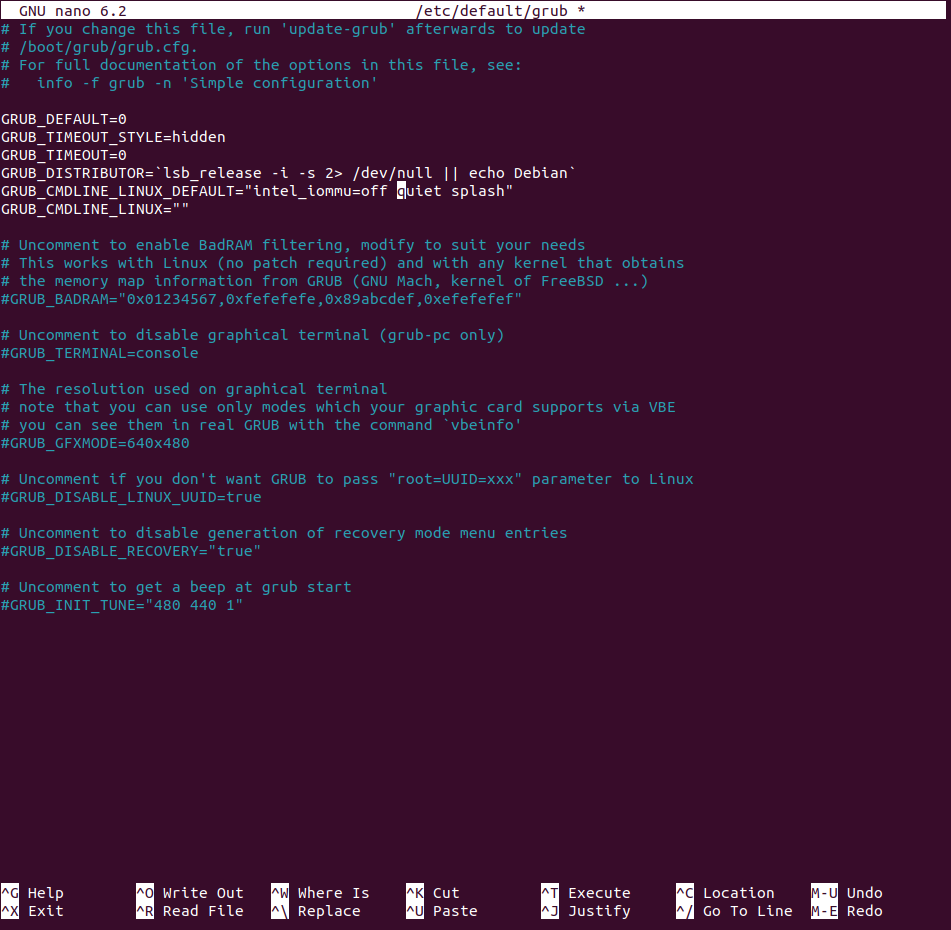

# Machine Pre-Requisites

### Windows WSL2 Ubuntu 22.04 Preparation

### Ubuntu 22.04 Preparation

Here's a similar guide to setup Lambda Stack on Ubuntu 20.04 https://lambdalabs.com/blog/set-up-a-tensorflow-gpu-docker-container-using-lambda-stack-dockerfile 

### Lambda Stack Installation and Configuration

https://lambdalabs.com/lambda-stack-deep-learning-software

### Lambda Stack Docker files

https://github.com/lambdal/lambda-stack-dockerfiles/


### CUDA Preparation for Machine

https://docs.nvidia.com/cuda/cuda-installation-guide-linux/index.html#prepare-ubuntu


#### Setup GPUDirect Storage (GDS) for Nvidia

https://docs.nvidia.com/gpudirect-storage/troubleshooting-guide/index.html#troubleshoot-install


```bash
sudo nano /etc/default/grub
```

Add the following to the GRUB_CMDLINE_LINUX_DEFAULT line:

```bash
GRUB_CMDLINE_LINUX_DEFAULT="intel_iommu=off quiet splash"
```



```bash
sudo update-grub
sudo reboot
```

https://docs.nvidia.com/cuda/cuda-installation-guide-linux/index.html#pre-installation-actions


sudo dpkg -i cuda-repo-<distro>_<version>_<architecture>.deb


Install the new cuda-keyring and cuda toolkit package:

```bash
wget https://developer.download.nvidia.com/compute/cuda/repos/ubuntu2204/x86_64/cuda-ubuntu2204.pin
sudo mv cuda-ubuntu2204.pin /etc/apt/preferences.d/cuda-repository-pin-600
wget https://developer.download.nvidia.com/compute/cuda/12.3.2/local_installers/cuda-repo-ubuntu2204-12-3-local_12.3.2-545.23.08-1_amd64.deb
sudo dpkg -i cuda-repo-ubuntu2204-12-3-local_12.3.2-545.23.08-1_amd64.deb
sudo cp /var/cuda-repo-ubuntu2204-12-3-local/cuda-*-keyring.gpg /usr/share/keyrings/
sudo apt-get update
sudo apt-get -y install cuda-toolkit-12-3
#Additional installation options are detailed here.
#Driver Installer	
#NVIDIA Driver Instructions (choose one option)
#To install the legacy kernel module flavor:
sudo apt-get install -y cuda-drivers
#To install the open kernel module flavor:
sudo apt-get install -y nvidia-kernel-open-545
sudo apt-get install -y cuda-drivers-545
```

#### Installing and configuring the Nvidia Container Toolkit

Configure the repository:
```bash
curl -fsSL https://nvidia.github.io/libnvidia-container/gpgkey | sudo gpg --dearmor -o /usr/share/keyrings/nvidia-container-toolkit-keyring.gpg
&& curl -s -L https://nvidia.github.io/libnvidia-container/stable/deb/nvidia-container-toolkit.list |
sed 's#deb https://#deb [signed-by=/usr/share/keyrings/nvidia-container-toolkit-keyring.gpg] https://#g' |
sudo tee /etc/apt/sources.list.d/nvidia-container-toolkit.list
&&
sudo apt-get update
```

Install the NVIDIA Container Toolkit packages:
```bash
sudo apt-get install -y nvidia-container-toolkit
```

Prerequisites
You installed a supported container engine (Docker, Containerd, CRI-O, Podman).

You installed the NVIDIA Container Toolkit.

Configuring Docker
Configure the container runtime by using the nvidia-ctk command:

sudo nvidia-ctk runtime configure --runtime=docker
The nvidia-ctk command modifies the /etc/docker/daemon.json file on the host. The file is updated so that Docker can use the NVIDIA Container Runtime.

Restart the Docker daemon:

sudo systemctl restart docker
Rootless mode
To configure the container runtime for Docker running in Rootless mode, follow these steps:

Configure the container runtime by using the nvidia-ctk command:

nvidia-ctk runtime configure --runtime=docker --config=$HOME/.config/docker/daemon.json
Restart the Rootless Docker daemon:

systemctl --user restart docker
Configure /etc/nvidia-container-runtime/config.toml by using the sudo nvidia-ctk command:

sudo nvidia-ctk config --set nvidia-container-cli.no-cgroups --in-place


wget https://developer.download.nvidia.com/compute/cuda/repos/ubuntu2204/x86_64/cuda-keyring_1.1-1_all.deb


### Nvidia GDS FS

#### MOFED

https://network.nvidia.com/products/infiniband-drivers/linux/mlnx_ofed/

https://github.com/NVIDIA/gds-nvidia-fs


#### Working with Nvidia Drivers on Linux

##### Triage flow
```bash
sudo apt purge ~nnvidia # I change this to `sudo apt purge '^nvidia-*'`
sudo apt autoremove
sudo apt clean
sudo apt update
sudo apt full-upgrade
sudo apt install system76-driver-nvidia
sudo systemctl reboot
glxinfo|egrep "OpenGL vendor|OpenGL renderer*"
nvidia-settings
nvidia-smi
```

Disable the active display drivers:
```bash
systemctl isolate multi-user.target
```
using modprobe to remove the active drivers:
```bash
modprobe -r nvidia-drm
```
Build dependencies for the nvidia-drivers-545 package:
```bash
sudo apt-get build-dep nvidia-drivers-545
```

```bash
sudo apt-get install -f
```

Once you've managed to replace/upgrade it and you're ready to start the graphical environment again, you can use this command:
```bash
systemctl start graphical.target
```


$ uname -a
Linux XXXX 5.8.0-44-generic #50~20.04.1-Ubuntu SMP Wed Feb 10 21:07:30 UTC 2021 x86_64 x86_64 x86_64 GNU/Linux

$ lsb_release -a

## Installing VSCode

https://code.visualstudio.com/docs/?dv=linux64_deb


## Installing Rust

https://www.rust-lang.org/tools/install

## Installing Python


## Installing Remote Desk Support

https://rustdesk.com/


### Reference
- https://unix.stackexchange.com/questions/440840/how-to-unload-kernel-module-nvidia-drm 
- https://github.com/Bumblebee-Project/Bumblebee/issues/699
- https://github.com/pop-os/pop/issues/2369
- https://forums.developer.nvidia.com/t/nvidia-driver-installation-unmet-dependencies/169501
- https://developer.nvidia.com/cuda-downloads
- https://github.com/NVIDIA/nvidia-container-toolkit/issues/86
- https://docs.docker.com/engine/install/ubuntu/#install-from-a-package
- https://docs.nvidia.com/datacenter/cloud-native/container-toolkit/latest/install-guide.html#installing-with-apt
- https://unix.stackexchange.com/questions/440840/how-to-unload-kernel-module-nvidia-drm
- https://askubuntu.com/questions/1219728/nvidia-x-server-settings-not-working-and-gpu-shown-as-unknown