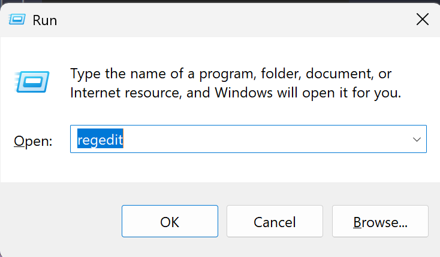
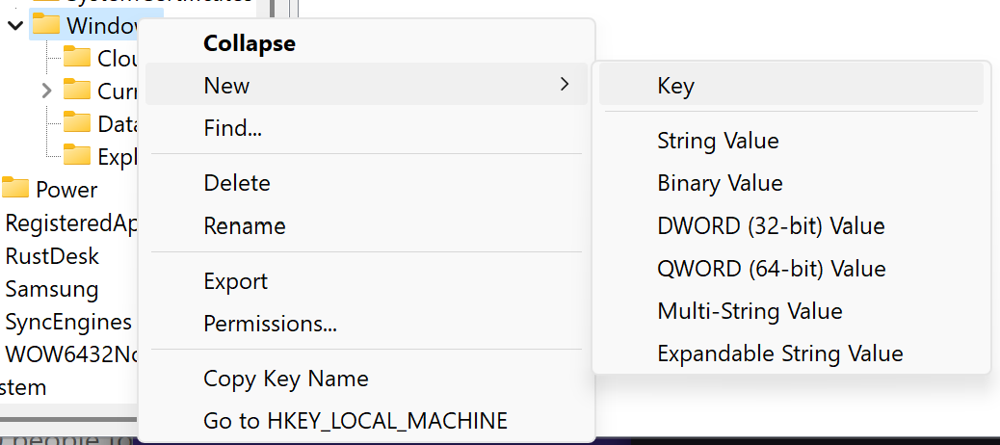
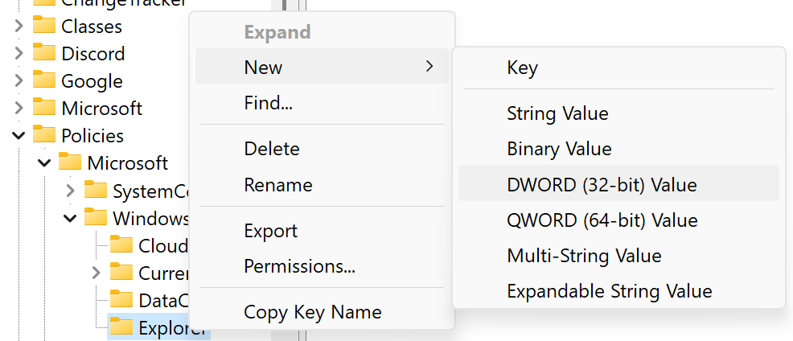
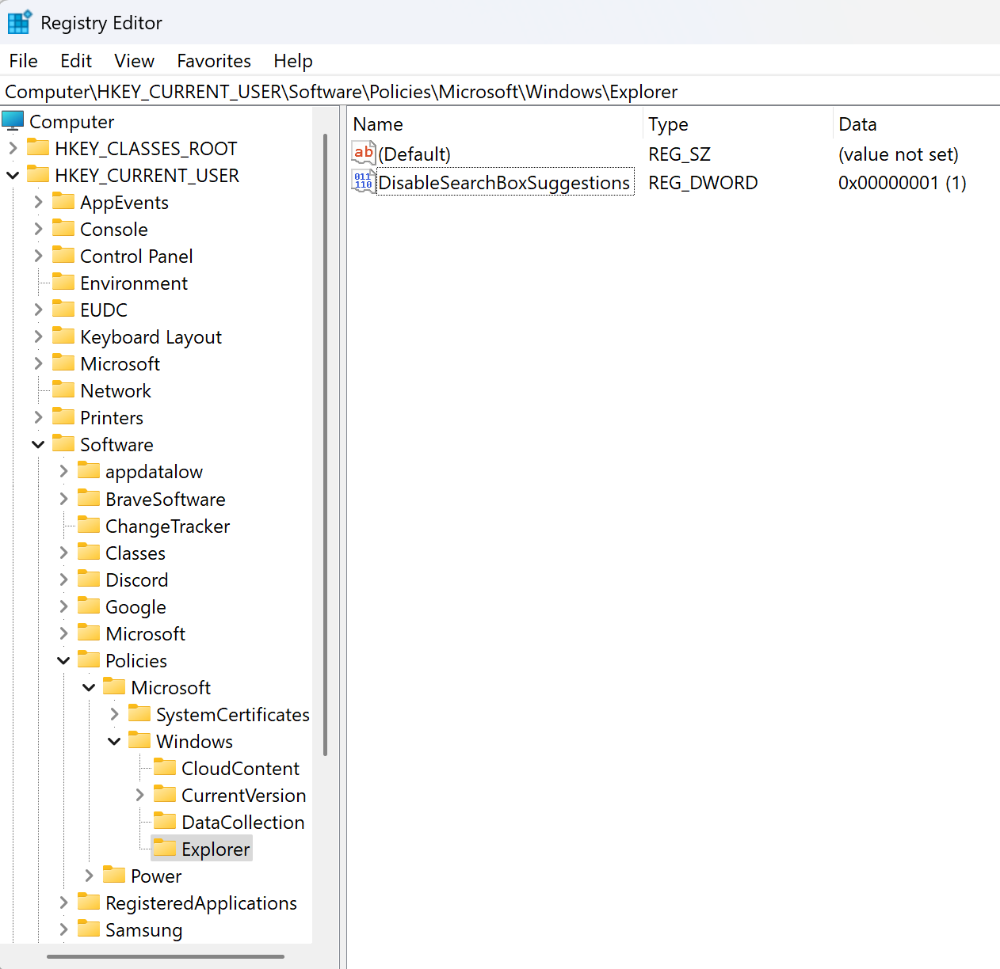
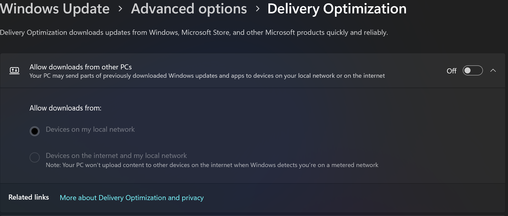

# Samsung Galaxy Book Edge 4 (Snapdragon Elite X1E-84-100)

## Initial Configuration for Windows 11

### Disable Internet Search for Windows Search

Force Windows to use only the local search index and not the internet for search results in the file explorer and search bar.

Reference : https://answers.microsoft.com/en-us/windows/forum/all/how-to-disable-search-the-web-completley-in/ea22410a-3031-487f-b5de-5a0113d656c5

#### 1. Open the Registry Editor by pressing `Win + R` and typing `regedit` and pressing `Enter`.

#### 2. Navigate to `HKEY_CURRENT_USER\Software\Policies\Microsoft\Windows`.
#### 3. Right-click on the `Windows` folder and select `New > Key` and name it `Explorer`.

#### 4. Right-click on the right pane and select `New > DWORD (32-bit) Value` and name it `DisableSearchBoxSuggestions`.
   

#### 5. Right-click on the new DWORD value and select `Modify` and set the value to `1`.

The final product should look something like this.

### Disable Windows Update Delivery Optimization

Disable Windows Update Delivery Optimization to prevent Windows from using your computer to distribute updates to other computers.

### Enable Legacy Right Click Context Menu for Windows 11 Explorer

### Setup PowerSettings to Optimize Usage and Battery Life

### Setup Windows Secure Access

#### Prompt for Scheduled Reboot Windows for Windows Updates

#### Force PIN Authentication

#### Setup Device and Account Recovery

### Uninstall Samsung Bloatware Apps

### Installing Developer Resources

#### VSCode

https://code.visualstudio.com/download

##### Enable Remote Window with WSL2 for VSCode

#### Git

https://git-scm.com/downloads

#### Github Desktop

https://desktop.github.com/download/

#### WSL2

#### Mirantis Lens

https://k8slens.dev/

https://k8slens.dev/download

#### Install Discord

https://discord.com/download

##### Creating a Company Discord Account

##### Bringing over a Personal Discord Account

##### Get Connected on Discord

Join the uhstray.io [discord](https://discord.uhstray.io) server.

### Proton

#### Proton Mail

https://account.proton.me/mail

https://proton.me/mail/download

#### Proton VPN

#### Proton Drive

Not compatible with ARM64 devices. Use the web interface.

https://account.proton.me/drive

For x86_x64 Architecture Devices:

https://proton.me/drive/download
