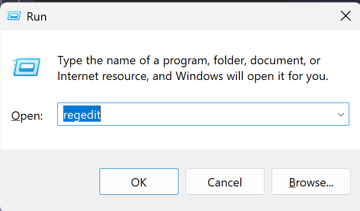
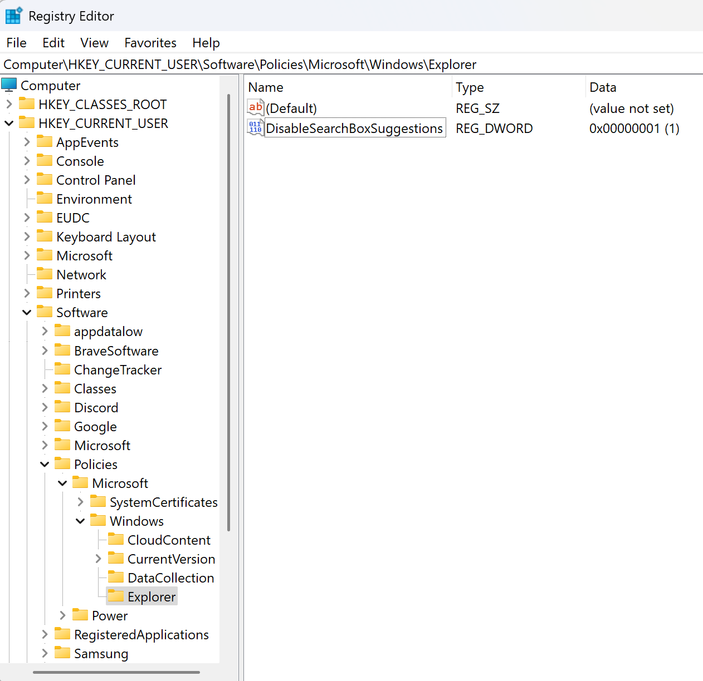

# Windows Workstation

- [Windows Workstation](#windows-workstation)
  - [Initial Configuration for Windows 11](#initial-configuration-for-windows-11)
    - [Windows Deinshitification Updates](#windows-deinshitification-updates)
      - [Win11Debloat](#win11debloat)
      - [ExplorerPatcher](#explorerpatcher)
      - [Disable Internet Search for Windows Search](#disable-internet-search-for-windows-search)
      - [Disable Windows Update Delivery Optimization](#disable-windows-update-delivery-optimization)
      - [Disable Windows Hibernation](#disable-windows-hibernation)
      - [Enable Legacy Right Click Context Menu for Windows 11 Explorer](#enable-legacy-right-click-context-menu-for-windows-11-explorer)
        - [Use the following commands to revert the changes:](#use-the-following-commands-to-revert-the-changes)
    - [Setup PowerSettings to Optimize Usage and Battery Life](#setup-powersettings-to-optimize-usage-and-battery-life)
    - [Setup Windows Secure Access](#setup-windows-secure-access)
      - [Prompt for Scheduled Reboot Windows for Windows Updates](#prompt-for-scheduled-reboot-windows-for-windows-updates)
      - [Force PIN Authentication](#force-pin-authentication)
      - [Setup Device and Account Recovery](#setup-device-and-account-recovery)
  - [Driver and 3rd Party Software Configuration](#driver-and-3rd-party-software-configuration)
    - [Nvidia Driver Updates](#nvidia-driver-updates)
    - [UART via USB Drivers](#uart-via-usb-drivers)
  - [Office and Productivity Software](#office-and-productivity-software)
    - [Browser Install \& Setup](#browser-install--setup)
    - [Microsoft OneDrive and Office](#microsoft-onedrive-and-office)
    - [Discord](#discord)
      - [Install Discord](#install-discord)
      - [Creating a Company Discord Account](#creating-a-company-discord-account)
      - [Bringing over a Personal Discord Account](#bringing-over-a-personal-discord-account)
      - [Get Connected on Discord](#get-connected-on-discord)
    - [Proton Mail, Drive, \& VPN](#proton-mail-drive--vpn)
      - [Proton Mail](#proton-mail)
      - [Proton VPN](#proton-vpn)
      - [Proton Drive](#proton-drive)
  - [Installing Developer Resources](#installing-developer-resources)
    - [Download Git \& Gitbash](#download-git--gitbash)
    - [Github Desktop](#github-desktop)
    - [Install VSCode](#install-vscode)
    - [Install \& Configure Python](#install--configure-python)
    - [Install \& Configure GO](#install--configure-go)
    - [Install Ubuntu WSL2](#install-ubuntu-wsl2)
      - [Enable Remote Window with WSL2 for VSCode](#enable-remote-window-with-wsl2-for-vscode)
    - [Docker](#docker)
      - [Docker Desktop](#docker-desktop)
        - [WSL2 Backend Configuration](#wsl2-backend-configuration)
        - [Docker Desktop Extensions](#docker-desktop-extensions)
      - [Docker Hub](#docker-hub)
    - [Mirantis Lens](#mirantis-lens)
    - [Putty for Remote Management](#putty-for-remote-management)

## Initial Configuration for Windows 11

### Windows Deinshitification Updates

#### Win11Debloat

Using Win11Debloat to remove unnecessary Windows 11 bloatware and telemetry services.

https://github.com/Raphire/Win11Debloat

#### ExplorerPatcher

https://github.com/valinet/ExplorerPatcher/tree/master

#### Disable Internet Search for Windows Search

Force Windows to use only the local search index and not the internet for search results in the file explorer and search bar.

Reference : https://answers.microsoft.com/en-us/windows/forum/all/how-to-disable-search-the-web-completley-in/ea22410a-3031-487f-b5de-5a0113d656c5

1. Open the Registry Editor by pressing `Win + R` and typing `regedit` and pressing `Enter`.

</a>

2. Navigate to `HKEY_CURRENT_USER\Software\Policies\Microsoft\Windows`.

3. Right-click on the `Windows` folder and select `New > Key` and name it `Explorer`.

</a>

4. Right-click on the right pane and select `New > DWORD (32-bit) Value` and name it `DisableSearchBoxSuggestions`.
   
</a>

5. Right-click on the new DWORD value and select `Modify` and set the value to `1`.

The final product should look something like this.

</a>

#### Disable Windows Update Delivery Optimization

Disable Windows Update Delivery Optimization to prevent Windows from using your computer to distribute updates to other computers.

</a>

#### Disable Windows Hibernation

https://learn.microsoft.com/en-us/troubleshoot/windows-client/setup-upgrade-and-drivers/disable-and-re-enable-hibernation

Run the Terminal as Administrator and run the following command:

```powershell
powercfg /hibernate off
```

#### Enable Legacy Right Click Context Menu for Windows 11 Explorer

Boot the terminal as an administrator and run the following commands:

```powershell
# Update the registry to enable the legacy right click context menu
reg.exe add "HKCU\Software\Classes\CLSID\{86ca1aa0-34aa-4e8b-a509-50c905bae2a2}\InprocServer32" /f /ve
# Kill the explorer.exe task
taskkill /f /im explorer.exe
# Restart the explorer.exe task to apply the changes
start explorer.exe
```

##### Use the following commands to revert the changes:

```powershell
reg.exe delete "HKCU\Software\Classes\CLSID\{86ca1aa0-34aa-4e8b-a509-50c905bae2a2}" /f
taskkill /f /im explorer.exe
start explorer.exe
```

Explorer must be restarted again for the effects to take change.

_Reference: https://answers.microsoft.com/en-us/windows/forum/all/restore-old-right-click-context-menu-in-windows-11/a62e797c-eaf3-411b-aeec-e460e6e5a82a_

### Setup PowerSettings to Optimize Usage and Battery Life

### Setup Windows Secure Access

#### Prompt for Scheduled Reboot Windows for Windows Updates

#### Force PIN Authentication

#### Setup Device and Account Recovery

---

## Driver and 3rd Party Software Configuration

### Nvidia Driver Updates

https://www.nvidia.com/en-us/drivers

### UART via USB Drivers

https://www.silabs.com/developers/usb-to-uart-bridge-vcp-drivers?tab=downloads

---

## Office and Productivity Software

### Browser Install & Setup

- [Download Brave Browser](https://brave.com/download/) Built on top of Chromium, our team recommends the Brave browser for its privacy, sync, and security features.
- [Download Firefox Browser](https://www.mozilla.org/firefox/download/thanks/) Firefox is a well established browser that is developer and privacy friendly.

### Microsoft OneDrive and Office

### Discord

#### Install Discord

For **x86_64** devices, we recommend using the official Discord app. For **ARM7/8** devices, we currently recommend using ARMCORD as the official Discord app can have hickups and stutters running the x64 architecture on your ARM device.

- [Discord Download](https://discord.com/download)
- [ARMCORD](https://armcord.app/),  [ARMCORD Github](https://github.com/ArmCord/ArmCord)

#### Creating a Company Discord Account

#### Bringing over a Personal Discord Account

#### Get Connected on Discord

Join the uhstray.io [discord](https://discord.uhstray.io) server.

### Proton Mail, Drive, & VPN

#### Proton Mail

https://account.proton.me/mail

https://proton.me/mail/download

#### Proton VPN

#### Proton Drive

Not compatible with ARM64 devices. Use the web interface.

https://account.proton.me/drive

For x86_x64 Architecture Devices:

https://proton.me/drive/download

---

## Installing Developer Resources

### Download Git & Gitbash

https://git-scm.com/downloads

### Github Desktop

https://desktop.github.com/download/

### Install VSCode

https://code.visualstudio.com/download

### Install & Configure Python


### Install & Configure GO

https://go.dev/dl/


### Install Ubuntu WSL2

https://learn.microsoft.com/en-us/windows/wsl/basic-commands

Open an Administrator Shell in Windows and run the below commands to install WSL2.

Show the list of available WSL distributions:

```powershell
wsl --list --online
```

Install the Selected Distro:

```powershell
wsl --install -d <distro-name>
```

#### Enable Remote Window with WSL2 for VSCode

### Docker

#### Docker Desktop

##### WSL2 Backend Configuration

https://docs.docker.com/desktop/wsl/

##### Docker Desktop Extensions


#### Docker Hub

### Mirantis Lens

https://k8slens.dev/

https://k8slens.dev/download


### Putty for Remote Management

https://www.putty.org/