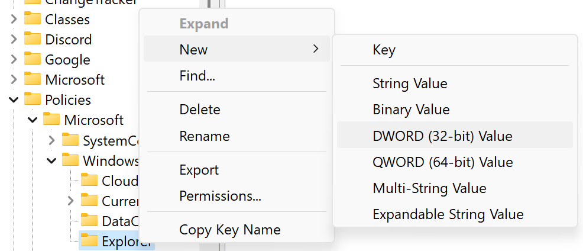
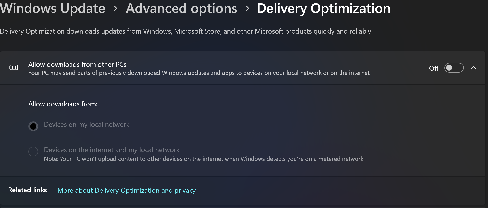

# Windows Workstation

## Initial Configuration for Windows 11

### Windows Deinshitification Updates

### Disable Internet Search for Windows Search

Force Windows to use only the local search index and not the internet for search results in the file explorer and search bar.

Reference : https://answers.microsoft.com/en-us/windows/forum/all/how-to-disable-search-the-web-completley-in/ea22410a-3031-487f-b5de-5a0113d656c5

#### 1. Open the Registry Editor by pressing `Win + R` and typing `regedit` and pressing `Enter`.

</a>

#### 2. Navigate to `HKEY_CURRENT_USER\Software\Policies\Microsoft\Windows`.
#### 3. Right-click on the `Windows` folder and select `New > Key` and name it `Explorer`.

</a>

#### 4. Right-click on the right pane and select `New > DWORD (32-bit) Value` and name it `DisableSearchBoxSuggestions`.
   
</a>

#### 5. Right-click on the new DWORD value and select `Modify` and set the value to `1`.

The final product should look something like this.

</a>

### Disable Windows Update Delivery Optimization

Disable Windows Update Delivery Optimization to prevent Windows from using your computer to distribute updates to other computers.



### Disable Windows Hibernation

https://learn.microsoft.com/en-us/troubleshoot/windows-client/setup-upgrade-and-drivers/disable-and-re-enable-hibernation

Run the Terminal as Administrator and run the following command:

```powershell
powercfg /hibernate off
```

### Enable Legacy Right Click Context Menu for Windows 11 Explorer

Boot the terminal as an administrator and run the following commands:

```powershell
# Update the registry to enable the legacy right click context menu
reg.exe add "HKCU\Software\Classes\CLSID\{86ca1aa0-34aa-4e8b-a509-50c905bae2a2}\InprocServer32" /f /ve
# Kill the explorer.exe task
taskkill /f /im explorer.exe
# Restart the explorer.exe task to apply the changes
start explorer.exe
```

#### Using the following commands to revert the changes:

```powershell
reg.exe delete "HKCU\Software\Classes\CLSID\{86ca1aa0-34aa-4e8b-a509-50c905bae2a2}" /f
taskkill /f /im explorer.exe
start explorer.exe
```

Explorer must be restarted again for the effects to take change.

_Reference: https://answers.microsoft.com/en-us/windows/forum/all/restore-old-right-click-context-menu-in-windows-11/a62e797c-eaf3-411b-aeec-e460e6e5a82a_

### Browser Install & Setup

### Nvidia Driver Updates

### Windows 11 Bloatware Removal

### Windows 11 Tweaks & Best Practices

### Microsoft OneDrive and Office

### Setup PowerSettings to Optimize Usage and Battery Life

### Setup Windows Secure Access

#### Prompt for Scheduled Reboot Windows for Windows Updates

#### Force PIN Authentication

#### Setup Device and Account Recovery

### Discord

#### Install Discord
For x86_64 devices, we recommend using the official Discord app.
For ARM devices, we currently recommend using ARMCORD as the official Discord app can have hickups and stutters running the x64 architecture on your ARM device.

- [Discord Download](https://discord.com/download)
- [ARMCORD](https://armcord.app/)
- [ARMCORD Github](https://github.com/ArmCord/ArmCord)

##### Creating a Company Discord Account

##### Bringing over a Personal Discord Account

##### Get Connected on Discord

Join the uhstray.io [discord](https://discord.uhstray.io) server.

### Download Git & Gitbash

https://git-scm.com/downloads

### Github Desktop

https://desktop.github.com/download/

### VSCode

https://code.visualstudio.com/download

#### Enable Remote Window with WSL2 for VSCode

### Proton Mail, Drive, & VPN

#### Proton Mail

https://account.proton.me/mail

https://proton.me/mail/download

#### Proton VPN

#### Proton Drive

Not compatible with ARM64 devices. Use the web interface.

https://account.proton.me/drive

For x86_x64 Architecture Devices:

https://proton.me/drive/download

### Installing Developer Resources

#### Mirantis Lens

https://k8slens.dev/

https://k8slens.dev/download